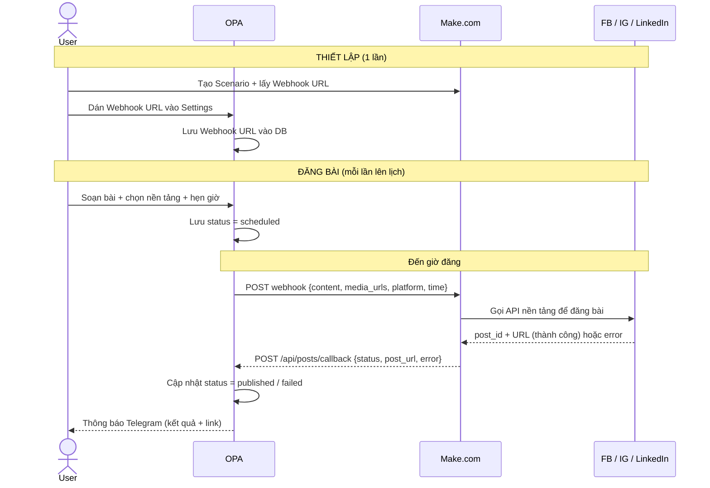
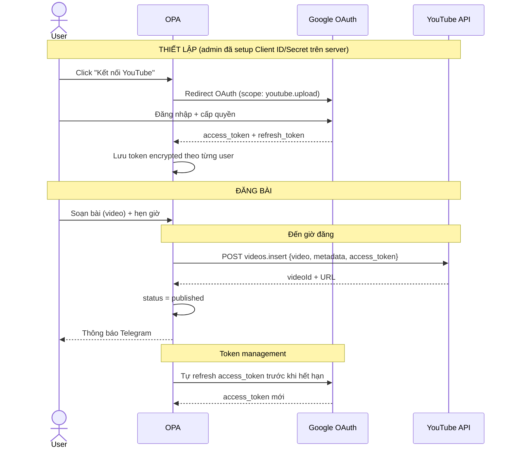
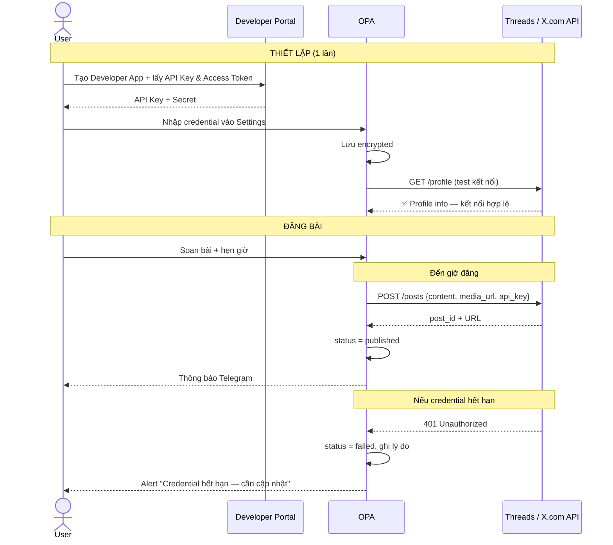

# PRD — OPA (Open Publishing Assistant)

> App giúp content creator và người kinh doanh đăng bài lên nhiều nền tảng social cùng lúc, lên lịch tự động, không phí cố định.

---

## ① Overview

- **App name:** OPA — Open Publishing Assistant
- **Tagline:** Soạn 1 bài, đăng khắp nơi — tự động, không cần ngồi chờ.
- **Problem:** Đăng một bài lên nhiều nền tảng (FB, IG, LinkedIn, YouTube, Threads, X.com) rất mất thời gian: phải soạn riêng từng nơi, nhớ ngày giờ, vào thủ công từng app. Dễ trễ, dễ sót, tốn ít nhất 1-2 tiếng/ngày.
- **Solution:** Soạn bài một lần trên OPA, chọn nền tảng, hẹn giờ — hệ thống tự đăng và báo cáo kết quả qua Telegram.
- **Platform:** Web (mobile-responsive). Không cần app riêng giai đoạn đầu.
- **Mô hình:** Không thu phí cố định. Chi phí dựa trên lượng bài đăng thực tế (pay-as-you-go).

---

## ①.1 Quy ước trạng thái Story

Mỗi User Story có ID theo format `{PREFIX}-NNN` (vd: `AUTH-001`, `POST-002`). Trạng thái được gắn bằng emoji ngay sau ID.

| Emoji | Trạng thái | Ý nghĩa |
|---|---|---|
| 📝 | Draft | Mới phác thảo, còn có thể thay đổi |
| ⏳ | Todo | Đã chốt scope, chưa bắt tay làm |
| 🔄 | In Progress | Đang làm |
| ⚠️ | Partial | Đã làm một phần, còn gap cần hoàn thiện |
| ✅ | Done | Đã làm xong, đã kiểm thử |

**Prefix theo Feature:**

| Prefix | Feature |
|---|---|
| `AUTH` | Feature 0 — Đăng ký & Đăng nhập |
| `CHN` | Feature 4 — Quản lý Kênh (Channels) |
| `POST` | Feature 1 — Soạn bài |
| `SCH` | Feature 2 — Lên lịch & đăng bài |
| `TRK` | Feature 3 — Theo dõi & quản lý bài đăng |
| `SUP` | Feature A1 — Setup Admin |
| `USR` | Feature A2 — Xem danh sách User |
| `DASH` | Feature A3 — Dashboard Admin |
| `TEL` | Feature 5 — Thông báo Telegram |
| `RPT` | Feature 6 — Báo cáo hiệu quả bài đăng |
| `SET` | Feature 7 — Settings & Profile |

---

## ② Target User

**Persona chính: Bình — Content Creator kiêm chủ shop**

- **Độ tuổi / nghề nghiệp:** 28–35 tuổi, chạy kinh doanh online hoặc làm content cho thương hiệu
- **Hàng ngày làm gì:** Viết bài, chọn ảnh, lên lịch, đăng lên 3–5 nền tảng, theo dõi kết quả
- **Nỗi đau cụ thể:**
  - Mỗi nền tảng có format khác nhau → phải soạn lại từng cái
  - Hay quên giờ đăng, đăng trễ → giảm reach
  - Không biết bài nào đăng thành công, bài nào lỗi
- **Tool đang dùng:** Vào thẳng từng trang social để đăng thủ công. Một số dùng Buffer/Hootsuite nhưng tốn kém.

---

## ②.0 Khái niệm cốt lõi — "Kênh" (Channel)

> Thuật ngữ quan trọng nhất trong OPA. Hiểu đúng khái niệm này sẽ hiểu toàn bộ luồng đăng bài.

**Kênh (Channel)** = 1 instance kết nối tới 1 tài khoản social cụ thể, có tên riêng do user đặt.

- 1 Kênh thuộc về đúng **1 nền tảng** (Facebook / Instagram / LinkedIn / YouTube / Threads / X.com)
- 1 nền tảng có thể có **nhiều Kênh** — ví dụ: user có 3 Fanpage khác nhau → tạo 3 Kênh Facebook riêng
- Mỗi Kênh có **loại kết nối** riêng:
  - **Webhook** (qua Make.com): dùng cho FB Page, Instagram, LinkedIn
  - **API trực tiếp** (API key / access token): dùng cho YouTube, Threads, X.com

**Ví dụ thực tế:**

| Tên Kênh | Nền tảng | Loại kết nối |
|---|---|---|
| Shop Cưng | Facebook | Webhook |
| Shop Cưng IG | Instagram | Webhook |
| Giải Trí Thể Thao | Facebook | Webhook |
| Channel Tutorial của Bình | YouTube | API |
| @binh_personal | X.com | API |

**Hệ quả về flow:**

- Khi **soạn bài** → user chọn **Kênh cụ thể** (tick 1 hoặc nhiều kênh), KHÔNG chọn platform chung chung
- Khi đăng bài → OPA đăng đúng theo từng Kênh đã tick (vd: tick "Shop Cưng" + "Shop Cưng IG" → đăng vào đúng Fanpage Shop Cưng và IG Shop Cưng, không đụng tới Kênh "Giải Trí Thể Thao")
- Báo cáo, quản lý, thống kê — mọi thứ đều gom theo Kênh

---

## ②.1 User Journey end-to-end

> Hành trình một user điển hình từ lúc biết tới OPA đến khi đăng bài thành công và nhận báo cáo.

### Giai đoạn 1 — Onboarding (ngày 0, ~10 phút)

1. Bình vào `opa.mecode.pro` lần đầu → thấy landing page + nút "Đăng ký"
2. Đăng ký bằng email + password → nhận email verify (optional) → đăng nhập
3. Vào dashboard rỗng — thấy **empty state** với 3 bước hướng dẫn: "Kết nối kênh → Soạn bài → Hẹn giờ"
4. Click "Kết nối kênh đầu tiên" → vào `/channels`
5. Chọn Facebook Page → thấy hướng dẫn 3 bước tạo Make.com Scenario (có link + screenshot)
6. Dán Webhook URL → OPA test ping → báo "Kết nối thành công ✅"

### Giai đoạn 2 — Bài đăng đầu tiên (ngày 0-1, ~5 phút)

1. Click "Soạn bài mới" → editor hiện ra với placeholder "Hôm nay bạn muốn chia sẻ gì?"
2. Gõ caption, upload 2 ảnh, chọn FB Page + Instagram
3. Chọn hẹn giờ → picker gợi ý "8h tối nay (giờ vàng)" → click
4. Lưu → bài vào trạng thái `scheduled`, hiện trong calendar
5. Bình đóng app, đi làm việc khác

### Giai đoạn 3 — Đăng tự động & thông báo (đến giờ hẹn)

1. OPA cron chạy → gọi Make.com webhook → Make đăng lên FB + IG
2. Make callback về OPA → status chuyển `published`, lưu link
3. OPA gửi Telegram: "✅ Đã đăng bài 'Combo áo thun mùa hè' lên FB + IG. Xem tại [link]"
4. Bình nhận thông báo, vào link check nhanh

### Giai đoạn 4 — Vòng lặp hàng ngày (từ ngày 2)

1. Sáng mở OPA → xem dashboard: 3 bài hôm qua đã đăng, 1 bài lỗi IG (token hết hạn)
2. Click vào bài lỗi → thấy lý do + nút "Kết nối lại IG"
3. Soạn 5 bài cho tuần sau → lên lịch một lượt qua calendar view
4. Cuối ngày 22h → nhận Telegram báo cáo tổng hợp

### Giai đoạn 5 — Tối ưu (tuần 2+)

1. Xem báo cáo hiệu quả (Feature 6) → biết bài nào reach cao
2. Lặp lại công thức thành công → soạn bài mới theo mẫu đó

---

## ③ Features & User Stories

> Mỗi feature gồm: Tên · Story · Done khi. Thứ tự các Feature được sắp theo dependency: Auth → Kênh → Soạn bài → Lên lịch → Theo dõi. Trạng thái mặc định hiện tại là ⏳ Todo (xem bảng ①.1).

---

### 🟢 MUST (bắt buộc có trong MVP)

---

#### Feature 0: AUTH-001 ✅ Đăng ký & Đăng nhập

**Story:** Là người dùng mới, tôi muốn tạo tài khoản và đăng nhập vào OPA, để hệ thống nhận ra tôi là ai và lưu bài đăng, kênh kết nối riêng cho tôi.

**Done khi:**
- ✅ Đăng ký bằng email + password (có validation: email hợp lệ, password ≥ 8 ký tự)
- ✅ Đăng nhập bằng email + password — nhận JWT, lưu session
- ✅ Trang quên mật khẩu — gửi link reset qua email
- ✅ Session tự động gia hạn khi còn dùng; hết hạn sau 7 ngày không hoạt động
- ✅ Đăng xuất — xóa session, redirect về trang login
- ✅ Redirect về trang trước đó sau khi đăng nhập (không mất context)
- ❌ Chưa cần đăng nhập bằng Google / Facebook OAuth
- ❌ Chưa cần 2FA
- ❌ Chưa cần magic link

**Story phụ — AUTH-002 ✅ Quên mật khẩu:**
*Là user không nhớ mật khẩu, tôi muốn đặt lại mật khẩu qua email để lấy lại quyền truy cập.*

- ✅ Click "Quên mật khẩu" trên trang login → nhập email → OPA gửi link reset (token ngắn hạn 15 phút)
- ✅ Trang reset yêu cầu nhập password mới + confirm → submit → tự động đăng nhập
- ✅ Nếu email không tồn tại trong hệ thống → vẫn hiện "Đã gửi email" (tránh enumeration attack)
- ✅ Link cũ tự invalidate sau khi đã dùng hoặc sau khi request link mới

**Story phụ — AUTH-003 ⚠️ Đổi mật khẩu:**
*Là user đang đăng nhập, tôi muốn đổi password ngay trong Settings để bảo mật tài khoản.*

- ✅ Vào Settings → tab Security → nhập current password + new password + confirm
- ✅ Sau khi đổi thành công → logout tất cả session khác (chỉ giữ session hiện tại)
- ✅ Gửi email thông báo "Mật khẩu đã được đổi lúc X" để user biết

**Empty state — AUTH-004 ⚠️ User vừa đăng nhập lần đầu:**
- ✅ Dashboard hiển thị welcome screen với 3 bước setup: "1. Kết nối kênh → 2. Soạn bài → 3. Hẹn giờ"
- ✅ Mỗi bước có progress indicator (0/3, 1/3...) — check xong thì tick xanh
- ✅ Có nút "Bỏ qua hướng dẫn" — chuyển về dashboard rỗng bình thường

---

#### Feature 4: CHN-001 ✅ Quản lý Kênh (Channels)

> **Lý do đặt trước Feature 1:** Soạn bài bắt buộc phải chọn Kênh → phải có ít nhất 1 Kênh trước khi dùng Feature 1.

**Story chính:** Là content creator, tôi vận hành nhiều thương hiệu/business khác nhau (vd: "Shop Cưng", "Giải Trí Thể Thao"), tôi muốn tạo nhiều **Kênh** riêng biệt — mỗi Kênh ứng với 1 tài khoản social cụ thể — để đăng bài đúng kênh và quản lý không bị lẫn lộn.

**Done khi:**

*Danh sách Kênh:*
- ✅ Trang `/channels` hiện toàn bộ Kênh của user dưới dạng list/grid
- ✅ Mỗi Kênh hiển thị: tên Kênh (do user đặt), icon nền tảng, loại kết nối (Webhook/API), trạng thái (active/expired/inactive), số bài đã đăng
- ✅ Sort/filter theo: nền tảng, trạng thái, ngày tạo
- ✅ Cho phép user tạo **nhiều Kênh cùng 1 nền tảng** (vd: 3 Kênh Facebook cho 3 Fanpage khác nhau)

*Thêm Kênh mới — flow chuẩn:*
- ✅ Trên trang danh sách Kênh → button "+ Thêm Kênh"
- ✅ **Bước 1 — Chọn nền tảng:** hiện grid 6 nền tảng (FB, IG, LinkedIn, YouTube, Threads, X.com). TikTok hiển thị mờ + badge "Sắp ra mắt"
- ✅ **Bước 2 — Chọn loại kết nối:** tùy nền tảng, hệ thống gợi ý đúng loại:
  - FB / IG / LinkedIn → mặc định **Webhook (Make.com)**, có link hướng dẫn tạo scenario
  - YouTube / Threads / X.com → mặc định **API key / Access token**
  - Nền tảng có nhiều option (vd: LinkedIn sau này) → user được chọn
- ✅ **Bước 3 — Nhập config:**
  - Nếu Webhook → input Webhook URL + button "Test ping"
  - Nếu API → input API key / access token (mask sau khi nhập), có thể thêm refresh_token nếu OAuth
- ✅ **Bước 4 — Đặt tên Kênh:** user nhập tên riêng (bắt buộc), vd: "Shop Cưng", "Giải Trí Thể Thao"
- ✅ **Bước 5 — Xác nhận & Test:** hệ thống test kết nối → nếu OK → lưu Kênh, quay về list
- ✅ Có thể bỏ dở giữa chừng — draft kênh không lưu

*Quản lý Kênh đã có:*
- ✅ Đổi tên Kênh
- ✅ Cập nhật credential (trường hợp đổi webhook URL mới, xoay API key)
- ✅ Tạm tắt Kênh (inactive) — vẫn giữ data nhưng không cho chọn khi soạn bài
- ✅ Xóa Kênh — confirm dialog cảnh báo các bài scheduled dùng Kênh này sẽ chuyển sang `failed`
- ✅ Cảnh báo khi credential hết hạn hoặc bị thu hồi quyền

*Ràng buộc:*
- ✅ Tên Kênh phải unique trong phạm vi 1 user
- ❌ TikTok chưa hỗ trợ
- ❌ Chưa cần chia sẻ Kênh giữa nhiều user (multi-tenant chỉ 1 user/1 Kênh)

**Story phụ — CHN-002 ✅ Test kết nối Kênh:**
*Là user vừa thêm Kênh, tôi muốn test xem credential/webhook hoạt động không, trước khi lên lịch bài thật.*

- ✅ Nút "Test kết nối" bên cạnh từng Kênh trong list
- ✅ Với Webhook: gửi 1 payload test → đợi callback trong 30s → báo OK/fail
- ✅ Với API: gọi endpoint `/profile` hoặc `/me` → xác nhận credential hợp lệ
- ✅ Hiển thị kết quả test rõ ràng (thời gian phản hồi + lý do nếu fail)

**Story phụ — CHN-003 ⚠️ Reconnect Kênh khi token hết hạn:**
*Là user nhận cảnh báo "Kênh Shop Cưng IG hết hạn", tôi muốn kết nối lại nhanh chóng ngay tại cảnh báo, không phải đi tìm.*

- ✅ Banner trên dashboard: "Kênh {tên Kênh} hết hạn — [Kết nối lại]"
- ✅ Click → deep link sang đúng detail Kênh đó, pre-fill thông tin cũ (trừ secret)
- ✅ Các bài đang `scheduled` của Kênh đó giữ nguyên; khi reconnect xong sẽ chạy tiếp

**Story phụ — CHN-004 ⏳ Xem lịch sử của 1 Kênh:**
*Là user, tôi muốn biết Kênh đã được tạo từ bao giờ, đổi credential lần gần nhất khi nào, và đã đăng được bao nhiêu bài qua Kênh đó.*

- ✅ Detail Kênh hiện: ngày tạo, lần update credential cuối, tổng số bài đã đăng, tỉ lệ thành công
- ✅ Link nhanh xem list bài đã đăng qua Kênh này
- ✅ Chỉ user sở hữu Kênh (và admin) mới xem được

**Story phụ — CHN-005 ⏳ Gom nhóm Kênh theo thương hiệu (Nice-to-have):**
*Là user quản lý nhiều business, tôi muốn gắn label/nhóm cho Kênh (vd: nhóm "Shop Cưng" gồm FB + IG), để dễ nhìn tổng quan.*

- ✅ Mỗi Kênh có thể gắn 1+ label do user tạo (vd: "Shop Cưng", "Giải Trí")
- ✅ Filter list Kênh theo label
- ✅ Khi soạn bài có thể quick-select toàn bộ Kênh trong 1 label

**Empty state — CHN-006 ✅ Chưa có Kênh nào:**
- ✅ Trang `/channels` hiện illustration + text lớn "Bạn chưa có Kênh nào — Tạo Kênh đầu tiên"
- ✅ CTA chính: button "+ Thêm Kênh"
- ✅ Kèm 3 case gợi ý đặt tên: "Shop Cưng", "Kênh cá nhân của tôi", "Giải Trí Thể Thao" để user hình dung

---

#### Feature 1: POST-001 ✅ Soạn bài

**Story:** Là content creator, tôi muốn soạn nội dung bài đăng gồm text, ảnh và video ngay trên OPA và **chọn các Kênh cụ thể sẽ đăng** (vd: "Shop Cưng" + "Shop Cưng IG" nhưng không đăng lên "Giải Trí Thể Thao"), để không phải soạn riêng trên từng nơi và không bị lẫn lộn giữa các thương hiệu.

**Done khi:**
- ✅ Nhập được text (có basic formatting: bold, xuống dòng)
- ✅ Upload được ảnh (JPG, PNG, tối đa 10MB/ảnh, tối đa 10 ảnh)
- ✅ Upload được video (MP4, tối đa 500MB)
- ✅ **Chọn được Kênh sẽ đăng** — list các Kênh active của user, tick 1 hoặc nhiều Kênh
- ✅ Kênh có thể thuộc cùng nền tảng hoặc khác nền tảng (vd: tick 2 Kênh Facebook khác nhau cùng lúc là OK)
- ✅ Mỗi Kênh đã tick → hiện icon nền tảng + tên Kênh để user xác nhận trực quan
- ✅ Nhóm hiển thị Kênh theo nền tảng, có search nhanh theo tên Kênh khi có nhiều Kênh
- ✅ Lưu bài dưới dạng draft khi chưa muốn đăng ngay
- ❌ Chưa cần AI gợi ý caption
- ❌ Chưa cần template có sẵn
- ❌ Chưa cần chỉnh ảnh / cắt video trong app
- ❌ TikTok chưa hỗ trợ

**Story phụ — POST-002 ✅ Tự động lưu draft:**
*Là content creator đang soạn dở bài, tôi muốn app tự lưu nội dung, để không mất dữ liệu khi bị ngắt mạng hoặc đóng tab nhầm.*

- ✅ Editor auto-save mỗi 10 giây khi có thay đổi
- ✅ Hiển thị indicator "Đã lưu" hoặc "Đang lưu..." ở góc editor
- ✅ Khi mở lại bài dở → khôi phục lại đúng nội dung cuối cùng đã auto-save

**Story phụ — POST-003 ⚠️ Preview bài trước khi lưu:**
*Là content creator, tôi muốn xem trước bài sẽ hiển thị thế nào trên từng Kênh đã chọn, để chỉnh caption/ảnh cho phù hợp trước khi đăng.*

- ✅ Panel preview show cạnh editor — đổi tab giữa các Kênh đã chọn
- ✅ Preview mock theo UI thật của nền tảng tương ứng (avatar + tên Kênh + caption + ảnh)
- ✅ Cảnh báo khi caption vượt giới hạn ký tự của nền tảng Kênh đó (X.com: 280, Threads: 500, LinkedIn: 3000)
- ✅ Hiện cảnh báo khi upload ảnh/video sai format (vd: chọn Kênh YouTube nhưng không có video)

**Story phụ — POST-004 ⚠️ Duplicate bài:**
*Là content creator, tôi muốn nhân đôi một bài cũ để chỉnh lại và đăng cho campaign tương tự, không cần soạn lại từ đầu.*

- ✅ Ở list bài hoặc detail bài → nút "Duplicate" → tạo bản sao ở trạng thái `draft`
- ✅ Bản sao giữ nguyên caption + media + **các Kênh đã chọn**; reset ngày giờ về trống
- ✅ Tên bài gốc thêm suffix "(Copy)" để phân biệt
- ✅ Nếu Kênh đã chọn ở bài gốc đã bị xóa/tạm tắt → tự động bỏ tick Kênh đó + hiện cảnh báo

**Empty state — POST-005 ⚠️ User chưa có bài nào:**
- ✅ Trang danh sách hiện illustration + CTA "Soạn bài đầu tiên của bạn"
- ✅ Có 2 link phụ: "Xem hướng dẫn" và "Tạo Kênh trước" (nếu chưa có Kênh)
- ✅ Nếu user chưa có Kênh nào → disable nút soạn bài, hiện tooltip "Tạo ít nhất 1 Kênh trước"
- ✅ Nếu user đã có Kênh nhưng tất cả đều ở trạng thái `expired`/`inactive` → vẫn cho soạn draft, nhưng chặn publish và gợi ý reconnect

---

#### Feature 2: SCH-001 ⏳ Lên lịch & đăng bài

**Story:** Là content creator, tôi muốn hẹn ngày giờ cho bài đã soạn để hệ thống tự đăng lên các **Kênh** đã chọn, không cần tôi phải ngồi chờ hay đăng thủ công.

**Done khi:**
- ✅ Thiết lập được ngày và giờ đăng (date + time picker)
- ✅ Hệ thống tự đăng đúng giờ lên tất cả **Kênh** đã chọn trong bài
- ✅ Có thể chỉnh sửa bài trước khi tới giờ đăng
- ✅ Có thể xóa bài đã lên lịch trước khi tới giờ đăng
- ✅ Xem được lịch biểu theo tuần/tháng — biết ngày nào có bài, ngày nào chưa
- ✅ Mỗi ô ngày trên calendar hiện card bài với: tiêu đề/đoạn caption, icon các Kênh sẽ đăng, giờ hẹn
- ❌ Chưa cần đăng lặp lại tự động (recurring post)
- ❌ Chưa cần bulk schedule từ file CSV

**Story phụ — SCH-002 ⚠️ Publish now (Đăng ngay):**
*Là content creator đang muốn post gấp, tôi muốn bỏ qua hẹn giờ để đăng liền lập tức.*

- ✅ Nút "Đăng ngay" bên cạnh "Hẹn giờ" trong editor
- ✅ Hệ thống đẩy bài vào queue xử lý ngay lập tức (trong vòng 30s)
- ✅ Sau khi đăng xong → trạng thái chuyển `published`, gửi Telegram như thường

**Story phụ — SCH-003 ⏳ Cảnh báo trùng giờ / sát giờ:**
*Là content creator, tôi muốn app cảnh báo khi tôi đặt 2 bài cùng giờ hoặc sát nhau trên cùng 1 Kênh, để tránh spam audience của Kênh đó.*

- ✅ Khi đặt giờ đăng cách bài khác < 15 phút trên **cùng 1 Kênh** → hiện warning (không chặn)
- ✅ Nếu khác Kênh (vd: "Shop Cưng" lúc 20h, "Giải Trí Thể Thao" lúc 20h01) → không warning vì audience khác nhau
- ✅ Validate giờ đăng phải ở tương lai (tối thiểu +5 phút từ thời điểm hiện tại)
- ✅ Hỗ trợ timezone theo user profile (mặc định Asia/Ho_Chi_Minh)

**Story phụ — SCH-004 ⏳ Kéo thả bài CHƯA LÊN LỊCH từ panel bên phải vào lịch:**
*Là content creator đã soạn sẵn nhiều bài draft, tôi muốn kéo thả trực tiếp từ panel "Bài chưa lên lịch" bên phải vào ô ngày trên calendar để hẹn giờ nhanh, không cần mở từng bài.*

- ✅ **Layout trang Lịch:** bố cục 2 cột — cột trái là calendar chính (tuần/tháng), **cột phải là sidebar "Bài chưa lên lịch"** có thể thu/mở
- ✅ Sidebar bên phải liệt kê tất cả bài ở trạng thái `draft`, sort mới nhất trước, có search theo tiêu đề
- ✅ Drag 1 bài từ sidebar phải → thả vào ô ngày bất kỳ trên calendar → hiện popup nhỏ chọn giờ (default 9h sáng)
- ✅ Sau confirm giờ → bài chuyển từ `draft` sang `scheduled`, biến mất khỏi sidebar phải, hiện thành card trong calendar
- ✅ Drag vào ngày quá khứ → chặn, hiện tooltip "Chỉ thả vào ngày từ hôm nay trở đi"
- ✅ Drag vào cell ngày có sẵn > 3 bài → vẫn cho thả, card tự xếp chồng + hiện "+N bài" nếu tràn
- ✅ Khi drag, cell ngày đích highlight (border xanh) để user thấy rõ sẽ thả vào đâu
- ✅ Hỗ trợ keyboard: chọn bài trong sidebar + phím mũi tên/Enter để di chuyển vào lịch (accessibility)

**Story phụ — SCH-005 ⏳ Kéo thả bài ĐÃ LÊN LỊCH giữa các ngày trên calendar:**
*Là content creator nhìn lịch tuần và muốn dời bài X sang ngày khác, tôi muốn drag trực tiếp card bài từ ngày A sang ngày B trên calendar, không cần vào detail bài.*

- ✅ Card bài `scheduled` trên calendar có cursor grab — có thể drag
- ✅ Drag card từ ngày A → thả vào ngày B trên calendar → bài reschedule, **giữ nguyên giờ cũ, chỉ đổi ngày**
- ✅ Nếu muốn đổi cả ngày lẫn giờ → thả xong, popup nhỏ hỏi "Đổi giờ không?" (Có/Giữ giờ cũ)
- ✅ Drag sang ngày quá khứ → chặn + tooltip
- ✅ Chỉ cho drag các bài còn ở trạng thái `scheduled` — bài `published`/`failed` khóa drag
- ✅ Sau drag thành công → ghi log vào timeline bài: "Reschedule từ {ngày A} sang {ngày B}"
- ✅ Có thể **drag ngược** bài `scheduled` từ calendar quay lại sidebar phải để huỷ lịch (bài → `draft`), confirm dialog trước khi làm

**Story phụ — SCH-006 ⏳ Reschedule bài đã lên lịch (ngoài drag-drop):**
*Là content creator ở thiết bị không thuận drag (mobile/tablet), tôi muốn cách đổi giờ đăng không dùng drag.*

- ✅ Ở detail bài hoặc popup edit → button "Đổi giờ đăng" → mở date/time picker
- ✅ Chỉ cho reschedule khi bài vẫn ở trạng thái `scheduled` (chưa tới giờ đăng hoặc chưa đăng xong)
- ✅ Sau reschedule → ghi log vào timeline bài (Feature 3 → Story phụ Timeline)

**Story phụ — SCH-007 ⏳ Chỉnh sửa bài trực tiếp trên lịch (popup KHÔNG rời trang):**
*Là content creator đang ở trang Lịch, tôi muốn click vào bài để sửa và popup mở ra **overlay ngay trên calendar** — không chuyển URL, không reload, không mất view đang quản lý (tuần đang xem, filter, scroll position).*

- ✅ Click vào card bài trên calendar → mở **popup editor** (modal overlay) **ngay trên chính trang Lịch**
- ✅ URL **không đổi**, trang Lịch bên dưới popup **không bị unmount** — scroll position, tuần/tháng đang xem, filter Kênh đã áp — tất cả giữ nguyên
- ✅ Popup gồm các field cơ bản: caption, media, Kênh đã chọn, ngày giờ
- ✅ 2 action chính: "Lưu" (đóng popup, giữ nguyên calendar) và "Mở trang chi tiết" (điều hướng sang route `/posts/:id` khi user muốn edit sâu hơn — đây mới là lúc rời trang Lịch, có xác nhận nếu đang có thay đổi chưa lưu)
- ✅ Nút "Xóa bài" và "Đăng ngay" cũng available trong popup
- ✅ Sau khi lưu → popup đóng, card trên calendar cập nhật ngay lập tức (không reload trang, không mất scroll/filter)
- ✅ Đóng popup bằng Esc / click backdrop / nút X → **không gây điều hướng**, luôn về lại đúng trang Lịch như lúc chưa mở
- ✅ Nếu popup có thay đổi chưa lưu và user cố đóng → hiện confirm "Bỏ thay đổi?"
- ✅ Với bài đã `published` hoặc `failed` → popup ở chế độ read-only, chỉ xem được, không edit
- ✅ Popup có phím tắt: `Esc` để đóng, `Cmd/Ctrl + S` để lưu

**Empty state — SCH-008 ⏳ Calendar trống:**
- ✅ Hiện illustration + hint "Chưa có bài nào lên lịch. Hẹn giờ bài đầu tiên?"
- ✅ Gợi ý khung giờ vàng phổ biến: 8h sáng, 12h trưa, 8h tối
- ✅ Quick action: "Xem drafts" (nếu có) để nhanh chóng chuyển draft → scheduled

---

#### Feature 3: TRK-001 ⚠️ Theo dõi & quản lý bài đăng

**Story:** Là content creator, tôi muốn biết bài nào đã đăng thành công, bài nào lỗi và link kết quả ở đâu, để tôi kiểm soát được hoạt động đăng bài mà không cần vào từng nền tảng kiểm tra.

**Done khi:**
- ✅ Xem được danh sách bài đăng với trạng thái: draft / scheduled / published / failed
- ✅ Xem được link bài đăng trực tiếp trên từng Kênh (sau khi đăng thành công)
- ✅ Xem được lý do thất bại nếu bài đăng lỗi (ví dụ: token hết hạn, video sai format) — chỉ rõ lỗi xảy ra ở Kênh nào
- ✅ Filter bài theo trạng thái, theo nền tảng, và theo **Kênh cụ thể**
- ✅ Với bài chọn nhiều Kênh, trạng thái hiển thị chi tiết: vd "3/4 Kênh đăng thành công, 1 Kênh lỗi"
- ❌ Chưa cần export danh sách bài ra Excel
- ❌ Chưa cần bulk delete

**Story phụ — TRK-002 ⏳ Timeline chi tiết 1 bài đăng:**
*Là content creator, tôi muốn xem log chi tiết của bài đăng (đã gửi webhook lúc nào, nhận callback lúc nào), để debug khi có vấn đề.*

- ✅ Detail bài hiện timeline: `created → scheduled → processing → published/failed`
- ✅ Mỗi step có timestamp + ghi chú (vd: "Đã gọi Make.com webhook lúc 20:00:03")
- ✅ Với bài failed: hiện error message đầy đủ (HTTP status + response body rút gọn)

**Story phụ — TRK-003 ⚠️ Retry bài đăng lỗi:**
*Là content creator thấy bài bị lỗi do token hết hạn, tôi muốn retry lại sau khi đã fix credential, thay vì soạn lại từ đầu.*

- ✅ Ở bài `failed` → button "Thử đăng lại" (enable khi user đã cập nhật credential/webhook)
- ✅ Click retry → bài quay về trạng thái `processing`, gọi lại luồng đăng
- ✅ Nếu retry thất bại 3 lần liên tiếp → disable button, yêu cầu user kiểm tra kết nối

**Story phụ — TRK-004 ⚠️ Filter nâng cao:**
*Là content creator có nhiều bài và nhiều Kênh, tôi muốn filter/search để nhanh tìm bài cần quản lý.*

- ✅ Filter: trạng thái, nền tảng, **Kênh cụ thể (multi-select)**, khoảng ngày (today/7d/30d/custom)
- ✅ Search theo tiêu đề hoặc 1 phần nội dung caption
- ✅ Sort theo: ngày tạo, giờ đăng, trạng thái
- ✅ Filter URL có query param để bookmark/share được (vd: `/posts?channels=shop-cung,giai-tri&status=failed`)

**Empty state — TRK-005 ✅ Chưa có bài nào:**
- ✅ Illustration + text "Bạn chưa có bài đăng nào" + CTA "Soạn bài đầu tiên"
- ✅ Link phụ: "Xem demo bài đăng mẫu" để user hình dung flow

---

### 🔴 ADMIN (bắt buộc — quản trị hệ thống)

---

#### Feature A1: SUP-001 ✅ Setup Admin

**Story:** Là người khởi tạo hệ thống, tôi muốn cấu hình tài khoản admin đầu tiên ngay lần truy cập đầu tiên, để hệ thống có người quản lý trước khi cho phép user khác đăng ký.

**Done khi:**

*First-run setup (chưa có user nào trong hệ thống):*
- ✅ Khi truy cập bất kỳ route nào mà DB chưa có user → tự động redirect về `/setup`
- ✅ Trang `/setup` hiển thị form đăng ký Admin đầu tiên: Email + Password + Confirm Password
- ✅ Sau khi submit thành công → tạo user với role `admin`, tự động đăng nhập, redirect về `/admin/dashboard`
- ✅ Sau khi có user đầu tiên → route `/setup` bị khoá vĩnh viễn (trả về 404 hoặc redirect về login)

*Quản lý role sau khi setup:*
- ✅ Admin có thể gán / thu hồi role `admin` cho user khác trong trang quản lý
- ✅ Route `/admin/*` bị chặn với người dùng không có role admin (trả về 403)
- ✅ Admin đăng nhập bằng cùng luồng với user thường, sau đó thấy menu Admin riêng trong sidebar
- ❌ Chưa cần phân quyền chi tiết theo từng tính năng (chỉ có 2 role: `user` và `admin`)
- ❌ Chưa cần audit log hành động của admin

**Story phụ — SUP-002 ✅ First-run UI khác biệt:**
*Là người cài đặt server lần đầu, tôi muốn trang setup trông chuyên nghiệp và đủ thông tin, để tự tin biết mình đang setup đúng thứ.*

- ✅ Trang `/setup` có logo OPA, tiêu đề "Khởi tạo tài khoản Admin đầu tiên"
- ✅ Giải thích rõ: "Đây là tài khoản sẽ quản lý toàn bộ hệ thống. Sau khi tạo, trang này sẽ bị khoá."
- ✅ Password field có chỉ báo mạnh/yếu real-time
- ✅ Sau khi tạo xong → redirect về `/admin/dashboard` kèm toast "Chào mừng admin — hệ thống đã sẵn sàng"

**Story phụ — SUP-003 ⏳ Promote user thường thành admin:**
*Là admin hiện tại, tôi muốn thăng cấp 1 user thường lên admin (vd: cộng tác viên mới), để chia sẻ việc vận hành.*

- ✅ Trong detail user → button "Gán role admin" (chỉ admin mới thấy)
- ✅ Confirm dialog: "User này sẽ có toàn quyền admin. Xác nhận?"
- ✅ Sau khi gán → user nhận email thông báo + lần login sau thấy menu admin

---

#### Feature A2: USR-001 ⚠️ Xem danh sách User

**Story:** Là admin, tôi muốn xem toàn bộ danh sách user đã đăng ký, để biết ai đang dùng hệ thống và quản lý khi cần.

**Done khi:**
- ✅ Xem danh sách user với các cột: Email, Ngày đăng ký, Role, Trạng thái (active / inactive), Số bài đã đăng
- ✅ Tìm kiếm user theo email
- ✅ Filter theo role (admin / user) và trạng thái
- ✅ Admin có thể khoá / mở khoá tài khoản user (khoá = không đăng nhập được, bài đã lên lịch không chạy)
- ✅ Admin có thể xem chi tiết 1 user: số bài, kênh đã kết nối, lần đăng nhập cuối
- ❌ Chưa cần export danh sách user ra Excel
- ❌ Chưa cần xóa vĩnh viễn tài khoản (chỉ khoá)

**Story phụ — USR-002 ⚠️ Reset password cho user:**
*Là admin, tôi muốn reset password giúp user bị quên mật khẩu và không vào được email, để hỗ trợ nhanh.*

- ✅ Trong detail user → button "Gửi link reset password" → OPA gửi email reset tới địa chỉ user
- ✅ Với user không còn truy cập được email: admin có thể set password tạm và báo user đổi lại
- ✅ Admin không thấy được password hiện tại của user (chỉ set mới)

**Story phụ — USR-003 ⏳ Xem bài đăng của 1 user cụ thể:**
*Là admin đang điều tra khi user báo lỗi, tôi muốn xem được list bài + status của user đó, để hỗ trợ chính xác.*

- ✅ Detail user có tab "Bài đăng" — hiện list như trang user bình thường nhưng read-only
- ✅ Admin có thể xem error message của bài failed, nhưng không chỉnh sửa content
- ✅ Đánh dấu rõ "Admin đang xem" — không tính vào hoạt động của user

**Empty state — USR-004 ⏳ Chưa có user nào ngoài admin:**
- ✅ List user hiện "Mới chỉ có admin — hãy share link đăng ký: opa.mecode.pro/register"
- ✅ Có nút copy link đăng ký để admin chia sẻ nhanh

---

#### Feature A3: DASH-001 ⚠️ Dashboard Admin

**Story:** Là admin, tôi muốn xem tổng quan hoạt động của hệ thống, để biết hệ thống đang chạy khoẻ không và có bao nhiêu người đang dùng.

**Done khi:**
- ✅ Hiển thị các chỉ số tổng quan:
  - Tổng số user / user mới trong 7 ngày
  - Tổng bài đã đăng / thành công / thất bại hôm nay và 7 ngày qua
  - Tỉ lệ thành công theo từng nền tảng (FB, IG, LinkedIn, YouTube, Threads, X.com)
- ✅ Bảng top bài lỗi gần nhất: ai đăng, nền tảng nào, lý do lỗi
- ✅ Dữ liệu tự refresh mỗi 5 phút (hoặc manual refresh)
- ❌ Chưa cần biểu đồ chart phức tạp — bảng số liệu là đủ
- ❌ Chưa cần alert / notification tự động khi tỉ lệ lỗi cao

**Story phụ — DASH-002 ⏳ Drill down vào bài lỗi:**
*Là admin thấy tỉ lệ lỗi cao trên 1 nền tảng, tôi muốn click vào số liệu để xem cụ thể các bài lỗi đó, thay vì phải tìm thủ công.*

- ✅ Click vào cell trong bảng tổng quan (vd: "FB: 12 thất bại") → chuyển sang list các bài lỗi tương ứng
- ✅ Filter sẵn theo platform + status + khoảng thời gian tương ứng
- ✅ Sort mặc định theo thời gian giảm dần (bài lỗi gần nhất ở trên)

**Empty state — DASH-003 ⏳ Dashboard mới, chưa có dữ liệu:**
- ✅ Khi tổng bài đăng = 0 → hiện "Chưa có dữ liệu" + gợi ý "Chia sẻ link cho user đăng ký để bắt đầu"
- ✅ Widget "tỉ lệ thành công" hiện "—" thay vì 0% để tránh hiểu nhầm

---

### 🔵 SHOULD (nên có, không gấp)

---

#### Feature 7: SET-001 ⏳ Settings & Profile

> **Lý do đặt trước Feature 5:** Settings là trang nền (Notifications / Security / Channels) mà Feature 5 (Telegram config) và các feature khác đều tham chiếu tới.

**Story chính:** Là user, tôi muốn có 1 trang Settings tập trung để quản lý thông tin cá nhân, preferences, kênh kết nối và bảo mật, để không phải đi tìm khắp các trang khác.

**Done khi:**

*Profile:*
- ✅ Hiện email (read-only), hiển thị ngày đăng ký + lần login cuối
- ✅ Đổi tên hiển thị (display name) — dùng khi gửi Telegram/email
- ✅ Chọn timezone (mặc định Asia/Ho_Chi_Minh) — ảnh hưởng tới mọi giờ hiển thị
- ✅ Chọn ngôn ngữ giao diện (MVP: chỉ tiếng Việt, sau này thêm English)

*Security:*
- ✅ Đổi password (cần nhập password cũ)

*Notifications:*
- ✅ Cấu hình Telegram (chat ID, toggle loại thông báo, giờ nhận báo cáo)
- ❌ Chưa cần cấu hình email notification

*Channels:*
- ✅ Link nhanh sang trang Kết nối kênh (Feature 4)
- ✅ Xem nhanh status của các kênh đã kết nối (active/expired)

*Account:*
- ✅ Xem thống kê cá nhân: tổng bài đăng, tổng kênh đã kết nối, dung lượng file đã dùng
- ❌ Chưa cần xóa tài khoản (GDPR) — giai đoạn sau

**Empty state — SET-002 ⏳ User mới vào settings lần đầu:**
- ✅ Hiện hint "Hãy cập nhật tên hiển thị + timezone để OPA phục vụ bạn tốt hơn"
- ✅ Highlight các ô chưa điền bằng badge "Nên điền"

---

#### Feature 5: TEL-001 ⏳ Thông báo Telegram

**Story:** Là dân marketing, tôi muốn nhận thông báo qua Telegram ngay khi bài đăng xong (thành công hay thất bại) và nhận báo cáo hàng ngày, để tôi kiểm soát mà không cần mở app.

**Done khi:**
- ✅ Kết nối được Telegram Bot bằng cách nhập chat ID
- ✅ Nhận tin ngay khi đăng xong: tên bài, nền tảng, trạng thái, link kết quả
- ✅ Nhận báo cáo tổng hợp cuối ngày: tổng bài đã đăng / thành công / lỗi
- ✅ Tắt/bật thông báo được trong settings
- ❌ Chưa cần thông báo qua email hoặc Slack

**Story phụ — TEL-002 ⏳ Kết nối Telegram 1 chạm:**
*Là user vào Settings, tôi muốn bấm 1 nút để tự động mở bot Telegram của OPA, nhấn Start là kết nối xong ngay — không cần tìm chat ID hay copy-paste gì cả.*

- ✅ Trang Settings (hoặc trang Kết nối Telegram) có nút "Kết nối Telegram" nổi bật
- ✅ Click nút → OPA tạo deeplink dạng `t.me/OpaBot?start={token}` (token duy nhất theo user, hết hạn sau 15 phút)
- ✅ Deeplink tự mở app Telegram (hoặc web Telegram) — không cần user tự tìm bot
- ✅ User nhấn nút **Start** trên bot → Bot nhận `chat_id`, gọi callback về OPA để lưu kết nối
- ✅ Ngay sau khi Start thành công → Bot gửi tin xác nhận: "✅ Kết nối OPA thành công! Bạn sẽ nhận thông báo tại đây."
- ✅ Trang Settings tự cập nhật: hiện trạng thái "Đã kết nối ✅" kèm username Telegram (không cần user refresh trang)
- ✅ Nếu token hết hạn (> 15 phút) → hiện thông báo "Link đã hết hạn — bấm lại để tạo link mới"
- ✅ Nếu user đã kết nối → bot gửi tin "Bạn đã kết nối rồi — không cần làm lại" thay vì tạo kết nối trùng
- ❌ Chưa cần hỗ trợ kết nối nhiều tài khoản Telegram cho 1 user

**Story phụ — TEL-003 ⏳ Chọn loại thông báo sau khi kết nối:**
*Là user vừa kết nối Telegram thành công, tôi muốn chọn ngay loại thông báo muốn nhận — đăng ký nhận ngay, báo cáo hàng ngày, hoặc hàng tuần — để không bị spam và nhận đúng thứ mình cần.*

- ✅ Ngay sau khi bot gửi tin xác nhận kết nối, bot tiếp tục gửi 1 tin với 3 nút lựa chọn nhanh:
  - 📣 **Nhận thông báo ngay** — báo mỗi khi bài đăng xong (thành công hoặc lỗi)
  - 📅 **Báo cáo tổng hợp hàng ngày** — gửi 1 lần vào 22h
  - 📆 **Báo cáo tổng hợp hàng tuần** — gửi vào 20h tối Chủ nhật
- ✅ User có thể chọn 1 hoặc nhiều tùy chọn — bot xác nhận từng lựa chọn
- ✅ Tùy chọn này đồng bộ về Settings trong OPA — user có thể vào đổi lại bất kỳ lúc nào
- ✅ Nếu user không chọn gì trong 5 phút → bot gửi nhắc nhở 1 lần; sau đó tự bật mặc định cả 3
- ✅ Mặc định khi chưa chọn: cả 3 đều bật

**Story phụ — TEL-004 ⏳ Test thông báo Telegram:**
*Là user vừa kết nối xong, tôi muốn bấm test để chắc chắn bot có thể nhắn cho mình, thay vì chờ tới khi đăng bài thật mới biết lỗi.*

- ✅ Button "Gửi test message" trong Settings sau khi đã kết nối
- ✅ Click → Bot gửi tin "🔔 Test thành công từ OPA — mọi thứ đang hoạt động tốt ✅"
- ✅ Nếu bot không gửi được → hiện hướng dẫn fix (vd: user đã block bot, hoặc chat_id hết hạn)

**Story phụ — TEL-005 ⏳ Tùy chọn loại thông báo (trong Settings):**
*Là user không muốn bị spam, tôi muốn vào Settings để chỉnh lại loại thông báo bất kỳ lúc nào.*

- ✅ Settings > Notifications có các toggle:
  - "Báo ngay khi đăng xong (thành công)"
  - "Báo ngay khi đăng lỗi"
  - "Báo cáo tổng hợp hàng ngày (22h)"
  - "Báo cáo tổng hợp hàng tuần (Chủ nhật 20h)"
- ✅ Mỗi toggle lưu riêng, có thể bật 1 hoặc nhiều
- ✅ Mặc định: cả 4 đều bật
- ✅ Thay đổi áp dụng từ lần gửi tiếp theo (không retroactive)

**Story phụ — TEL-006 ⏳ Đổi giờ nhận báo cáo hàng ngày:**
*Là user ở múi giờ khác hoặc muốn nhận báo cáo lúc khác, tôi muốn đổi giờ gửi báo cáo tổng hợp.*

- ✅ Input time picker trong settings — chọn giờ (mặc định 22:00 Asia/Ho_Chi_Minh)
- ✅ Áp dụng cho lần gửi tiếp theo

**Empty state — TEL-007 ⏳ User chưa có bài trong ngày:**
- ✅ Báo cáo tổng hợp hôm đó không gửi (không spam "0 bài đăng hôm nay")
- ✅ Chỉ gửi khi có ít nhất 1 bài được xử lý trong ngày

---

#### Feature 6: RPT-001 ⏳ Báo cáo hiệu quả bài đăng

**Story:** Là dân marketing, tôi muốn xem chỉ số bài đăng (like, comment, share, view, reach) ngay trên OPA, để biết bài nào hiệu quả mà không cần vào từng trang social.

**Done khi:**
- ✅ Hiển thị được: like, comment, share, view, reach theo từng bài và từng nền tảng
- ✅ So sánh chỉ số giữa các bài trong cùng khoảng thời gian
- ✅ Dữ liệu được sync lại sau 24h kể từ lúc đăng
- ❌ Chưa cần chart / visualization phức tạp
- ❌ Chưa cần export báo cáo ra PDF

**Story phụ — RPT-002 ⏳ Filter báo cáo theo khoảng thời gian:**
*Là content creator muốn xem hiệu quả trong tuần/tháng cụ thể, tôi muốn filter báo cáo theo khoảng ngày.*

- ✅ Date range picker: 7 ngày / 30 ngày / 90 ngày / custom
- ✅ Dữ liệu load lại theo khoảng chọn, kèm so sánh % với kỳ trước (vd: "Tuần này reach +12% so với tuần trước")
- ✅ URL có query param để share được (vd: `/reports?from=2026-04-01&to=2026-04-14`)

**Story phụ — RPT-003 ⏳ Top bài hiệu quả nhất:**
*Là content creator, tôi muốn biết 5 bài hiệu quả nhất tháng qua để học cách viết tương tự.*

- ✅ Widget "Top 5 bài" sort theo reach (có toggle sang sort theo engagement)
- ✅ Click vào bài → mở detail kèm link gốc trên nền tảng
- ✅ Hiển thị đồng thời thumbnail + caption ngắn + chỉ số chính

**Empty state — RPT-004 ⏳ Bài mới đăng < 24h:**
- ✅ Bài đăng trong vòng 24h hiện "Đang thu thập dữ liệu..." thay vì 0 reach
- ✅ Tooltip giải thích: "Chỉ số được sync lại sau 24h kể từ lúc đăng"

---

### 🟠 NICE TO HAVE (giai đoạn sau)

- [ ] **TikTok** — Hỗ trợ khi TikTok API mở cho developer nhỏ
- [ ] **AI gợi ý caption** — Nhập ảnh/chủ đề, AI viết 3 phiên bản caption để chọn
- [ ] **Template bài đăng** — Lưu format bài hay dùng để tái sử dụng
- [ ] **Bulk import** — Upload file CSV để lên lịch hàng loạt
- [ ] **Recurring post** — Đặt bài tự đăng lặp lại theo chu kỳ
- [ ] **Team collaboration** — Nhiều người cùng soạn/duyệt bài trong 1 workspace

---

## ④ Tech Stack

| Layer | Tech | Lý do chọn |
|---|---|---|
| Frontend | Next.js 14 (App Router) | SSR tốt cho SEO, routing đơn giản |
| Styling | Tailwind CSS | Nhanh, không cần design system phức tạp |
| Backend | Next.js API Routes | Dùng chung repo, đủ cho giai đoạn đầu |
| Database | PostgreSQL (self-hosted trên VPS) | Không vendor lock-in, toàn quyền kiểm soát |
| Auth | NextAuth.js | Tự host, hỗ trợ OAuth nhiều provider, không phụ thuộc dịch vụ ngoài |
| File storage | AWS S3 | Chuẩn industry, không lock-in, rẻ khi scale |
| Job queue | Make.com (Webhook) | Xử lý scheduling và gọi social API |
| Notifications | Telegram Bot API | Đơn giản, không cần setup server email |
| Hosting | VPS (chost.mecode.pro) | Tự control, chi phí thấp |

---

## ⑤ Integration Points

> OPA dùng 2 cơ chế khác nhau tùy nền tảng: Make.com webhook (FB, IG, LinkedIn) và API credential trực tiếp (Threads, X.com). YouTube dùng OAuth nhưng admin setup sẵn.

---

### Sơ đồ tổng quan — Cơ chế 1: Make.com Webhook (FB, IG, LinkedIn)

---

### Sơ đồ tổng quan — Cơ chế 2a: YouTube OAuth (admin setup sẵn)

---

### Sơ đồ tổng quan — Cơ chế 2b: Direct Credential (Threads, X.com)

---

### Nhóm 1: Facebook Page, Instagram, LinkedIn — qua Make.com

**Lý do dùng Make.com:** Các nền tảng này yêu cầu OAuth phức tạp và review app. Make.com đã có sẵn connector được duyệt → không cần tự xin permission.

**Luồng kết nối:**
1. User tạo Scenario trên Make.com, dùng module FB/IG/LinkedIn của Make.com để cấp quyền
2. User thêm Webhook trigger vào Scenario, lấy Webhook URL
3. User dán Webhook URL vào OPA → OPA lưu URL vào DB

**Luồng đăng bài:**
1. Đến giờ đăng → OPA gọi POST tới Webhook URL của Make.com, gửi kèm payload: `{title, content, media_urls, platform, post_time}`
2. Make.com nhận webhook → gọi API của nền tảng tương ứng để đăng bài
3. Make.com gọi OPA callback endpoint `/api/posts/callback` với kết quả: `{post_id, status, url, error}`
4. OPA cập nhật status bài, lưu link, gửi thông báo Telegram

❌ Không xử lý: OPA không biết nội dung bên trong Make.com Scenario. Nếu Scenario bị tắt/lỗi, OPA chỉ nhận được timeout — ghi `failed`.

---

### Nhóm 2a: YouTube — OAuth (admin setup sẵn)

**Lý do:** Admin OPA đã tạo sẵn Google OAuth App và cấu hình Client ID/Secret trên server. User chỉ cần bấm "Kết nối YouTube" và OAuth vào account của mình — không cần vào Developer Console.

**Luồng kết nối:**
1. User click "Kết nối YouTube" → OPA redirect sang Google OAuth (dùng Client ID của OPA)
2. User đăng nhập Google, cấp quyền `youtube.upload`
3. Google trả về `access_token` + `refresh_token` → OPA lưu encrypted theo từng user
4. OPA tự refresh token khi hết hạn (access token < 1 giờ, refresh token dài hạn)

**Luồng đăng bài:**
1. Đến giờ đăng → OPA gọi YouTube Data API v3 `videos.insert` để upload video
2. YouTube trả về `videoId` → OPA lưu link `youtube.com/watch?v={videoId}`
3. Cập nhật status bài → gửi thông báo Telegram

❌ Không xử lý: YouTube Shorts (chưa hỗ trợ format riêng). Bài text-only (YouTube chỉ nhận video).

---

### Nhóm 2b: Threads & X.com — API credential trực tiếp

**Lý do:** Threads/X.com API yêu cầu user tự tạo Developer App — OPA không thể làm OAuth thay vì chính sách của các nền tảng này còn hạn chế.

**Luồng kết nối:**
1. User tự tạo Developer App trên Threads / X Developer Portal → lấy API Key + Access Token
2. User nhập credential vào OPA → lưu encrypted
3. OPA test kết nối bằng cách gọi API profile → xác nhận hợp lệ

**Luồng đăng bài:**
1. Đến giờ đăng → OPA gọi API tương ứng (Threads Graph API / X API v2)
2. Nhận `post_id` / `tweet_id` → lưu link bài
3. Cập nhật status → gửi thông báo Telegram

❌ Không xử lý: Thread dạng chuỗi nhiều bài (chỉ hỗ trợ single post). Video trên X.com (chỉ hỗ trợ text + ảnh giai đoạn đầu).

---

### TikTok

❌ Chưa hỗ trợ trong MVP. Dự kiến giai đoạn sau nếu TikTok API mở rộng cho developer nhỏ.

---

### Telegram Bot Notification

1. User vào Settings → nhấn "Kết nối Telegram" → OPA hiển thị link `t.me/OpaBot?start={token}`
2. User click link → mở Telegram, Bot tự nhận `chat_id` qua lệnh `/start`
3. OPA lưu `chat_id` vào user profile
4. Sau mỗi lần đăng bài → OPA gọi Telegram Bot API gửi tin nhắn kết quả
5. Mỗi ngày 22:00 → OPA gửi báo cáo tổng hợp

❌ Không xử lý: Lệnh 2 chiều qua Bot (chỉ nhận thông báo 1 chiều từ OPA)

---

## ⑥ Non-Functional Requirements

- **Performance:** Trang load < 2s. API response < 1s (trừ upload file)
- **Security:** JWT auth. Token social lưu encrypted (AES-256). HTTPS only. Input sanitization chống XSS
- **Responsive:** Web mobile-responsive. Không cần native app
- **Concurrency:** Hỗ trợ tối đa 100 user cùng lúc trong giai đoạn MVP
- **File limits:** Ảnh tối đa 10MB/file, video tối đa 500MB/file
- **Uptime:** 95% (có thể downtime khi deploy). SLA cao hơn sau khi có paying users
- **Data retention:** Giữ log bài đăng tối thiểu 90 ngày

---

## ⑦ Edge Cases & Error States

| Tình huống | Hành vi mong muốn |
|---|---|
| Make.com Webhook URL bị tắt / Scenario bị disable | Đánh dấu bài `failed`, ghi lý do "Webhook không phản hồi", gửi thông báo Telegram |
| Make.com Scenario lỗi khi đăng (FB/IG/LinkedIn) | OPA nhận callback lỗi từ Make.com → ghi lý do, đánh dấu `failed`, thông báo user |
| API credential YouTube/Threads/X.com hết hạn | Đánh dấu `failed`, gửi thông báo "Credential hết hạn — cần cập nhật lại" |
| YouTube access_token hết hạn (< 1 giờ) | OPA tự refresh bằng refresh_token. Nếu refresh_token cũng hết → alert user |
| Video upload quá nặng (> 500MB) | Hiện thông báo lỗi khi upload, không cho lưu bài |
| User upload ảnh nhưng chọn YouTube (chỉ nhận video) | Cảnh báo ngay khi chọn nền tảng: "YouTube chỉ hỗ trợ video" |
| Mất mạng khi đang upload ảnh/video | Hiện thông báo lỗi, giữ nguyên nội dung đã nhập để user retry |
| 2 bài cùng giờ đăng lên cùng 1 nền tảng qua Make.com | Cho phép — Make.com xử lý queue theo thứ tự |
| Make.com callback về OPA bị chậm / timeout | OPA giữ status `processing`, cập nhật khi nhận được callback. Sau 10 phút không nhận → đánh dấu `failed` |
| Nền tảng thay đổi API (breaking change) | Make.com connector tự cập nhật cho FB/IG/LinkedIn. Với YouTube/Threads/X.com → cần cập nhật code OPA |
| Session hết hạn giữa chừng | Redirect về trang login, giữ lại URL để redirect lại sau khi đăng nhập |
| Đăng ký email đã tồn tại | Hiện thông báo "Email này đã được dùng", không tạo account mới |
| Reset password link hết hạn (> 15 phút) | Hiện thông báo "Link đã hết hạn", cho phép gửi lại |
| User bị admin khoá đang có session active | Logout ngay lần request tiếp theo, hiện thông báo "Tài khoản bị tạm khoá" |
| User bị khoá có bài đang lên lịch | Không chạy các bài đã schedule, giữ nguyên status `scheduled` — khi mở khoá sẽ chạy lại |
| Admin tự khoá tài khoản của mình | Không cho phép — hiện thông báo "Không thể khoá tài khoản admin đang đăng nhập" |
| Truy cập hệ thống lần đầu (chưa có user) | Redirect toàn bộ route về `/setup` — không cho vào login hay trang nào khác |
| Truy cập `/setup` khi đã có user | Trả về 404 — trang setup không tồn tại nữa |
| Submit `/setup` với email đã tồn tại | Không xảy ra được (setup chỉ chạy khi DB rỗng) — nhưng nếu race condition xảy ra thì trả về lỗi 409 |

---

## ⑧ Success Metrics

| Mốc | Chỉ số | Target |
|---|---|---|
| **Tuần 1** | User hoàn thành kết nối kênh đầu tiên | ≥ 5 user |
| **Tuần 2** | Bài đăng tự động thành công (không lỗi) | ≥ 90% bài đăng |
| **Tháng 1** | Active user (đăng ≥ 1 bài/tuần) | ≥ 20 user |
| **Tháng 1** | Thời gian trung bình soạn + lên lịch 1 bài | < 5 phút |
| **Tháng 3** | Paying user (nếu có plan trả phí) | ≥ 10 |
| **Tháng 3** | Tỉ lệ bài đăng thành công | ≥ 95% |

---

## ⑨ Constraints & Assumptions

**Giới hạn:**
- **Budget:** Bootstrap, không có funding. Chi phí VPS + Make.com < $50/tháng ban đầu
- **Timeline:** MVP trong 4–6 tuần (build 1 người với AI)
- **Team:** 1 người — Bình (founder + developer)
- **Tech constraints:** Không dùng Figma. UI build trực tiếp bằng Tailwind + Claude. Không tự build mobile app native

**Assumptions (giả định):**
- User đã có tài khoản Facebook Business / TikTok Creator / YouTube channel
- Các nền tảng không thay đổi OAuth policy trong vòng 3 tháng đầu
- Make.com free tier đủ dùng cho giai đoạn MVP (< 1000 operations/tháng)
- User sẵn sàng dùng Telegram để nhận thông báo
- Bài đăng không cần approval workflow (1 người dùng, không cần duyệt)

---

## Changelog

| Ngày | Thay đổi | Người cập nhật |
|---|---|---|
| 2026-04-13 | v1 — PRD đầu tiên, 4 MUST features + 2 SHOULD | Bình |
| 2026-04-13 | v2 — Thêm Feature 0 (Auth), nhóm ADMIN (A1 Setup Admin, A2 Danh sách User, A3 Dashboard), 6 edge cases mới | Bình |
| 2026-04-17 | v3 — Làm giàu user story: thêm section ②.1 User Journey end-to-end (5 giai đoạn); bổ sung story phụ + empty states cho toàn bộ Feature 0-6 + A1-A3; thêm Feature 7 (Settings & Profile) | Bình |
| 2026-04-17 | v4 — **Concept shift**: chuyển từ "Platform" sang "Kênh (Channel)". 1 nền tảng có thể có nhiều Kênh (vd: "Shop Cưng" + "Giải Trí Thể Thao" cùng là FB). Thêm section ②.0 Khái niệm cốt lõi. Viết lại Feature 4 theo flow "Thêm Kênh 5 bước". Feature 1 đổi từ chọn platform → chọn Kênh cụ thể. Feature 2 thêm story kéo thả bài draft vào lịch + chỉnh sửa bài inline qua popup trên calendar. Feature 3 filter theo Kênh | Bình |
| 2026-04-17 | v4.1 — Làm rõ Feature 2: tách riêng 2 story drag-drop (từ sidebar phải → lịch / giữa các ngày trên lịch), thêm drag ngược để huỷ lịch. Explicit-hoá story popup edit: overlay trên trang Lịch, URL không đổi, scroll/filter/tuần đang xem được giữ nguyên khi đóng popup | Bình |
| 2026-04-24 | v4.2 — Feature 5: thêm Story phụ "Kết nối Telegram 1 chạm" (deeplink, auto chat_id, tin xác nhận từ bot); thêm Story phụ "Chọn loại thông báo sau khi kết nối" (bot hỏi ngay sau Start với 3 nút: nhận ngay / hàng ngày / hàng tuần); bổ sung toggle "Báo cáo hàng tuần" vào Settings | Bình |
| 2026-04-24 | v4.3 — **Tracking**: thêm ID `{PREFIX}-NNN` cho từng Story (AUTH/CHN/POST/SCH/TRK/SUP/USR/DASH/TEL/RPT/SET) + trạng thái ⏳ Todo mặc định. Thêm bảng quy ước trạng thái tại ①.1. Sắp xếp lại dependency: trong MUST đặt Feature 4 (Quản lý Kênh) **trước** Feature 1 (Soạn bài); trong SHOULD đặt Feature 7 (Settings) **trước** Feature 5 (Telegram) vì Settings là trang nền của Telegram config. Nội dung các Story giữ nguyên 100%, chỉ đổi thứ tự + thêm ID | Bình |
| 2026-05-08 | v4.4 — **Status sync**: cập nhật trạng thái sau Sprint 1. Done ✅: AUTH-001, AUTH-002, CHN-001, CHN-002, CHN-006, POST-001, POST-002, TRK-005, SUP-001, SUP-002. Partial ⚠️: AUTH-003 (API done / Settings UI chưa), AUTH-004 (3-step guide có nhưng thiếu progress indicator + skip), CHN-003 (banner dashboard có, deep link chưa đúng channel), POST-003 (mini preview có, chưa đủ per-channel + char limit), POST-004 (API done, UI chưa có), POST-005 (empty state có, thiếu tooltip khi kênh expired), SCH-002 (API done, UI chưa có trong composer), TRK-001 (list + filter status/platform/search done, thiếu filter by channel + URL params), TRK-003 (API done, UI cần post detail page), TRK-004 (filter status/platform done, thiếu channel multi-select + URL params), USR-001/USR-002 (API done, UI skeleton), DASH-001 (2 stat cơ bản, thiếu breakdown nền tảng + bảng lỗi). Còn lại giữ ⏳ Todo | Bình |
